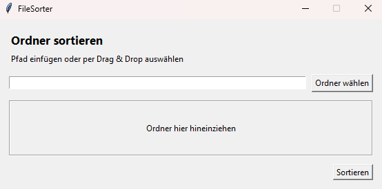
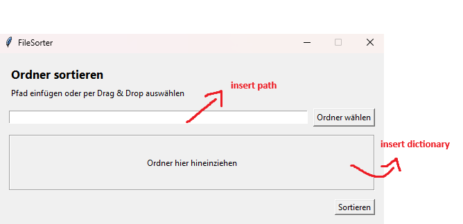

# FileSorter

FileSorter ist ein in **Python** geschriebenes Programm mit **grafischer Oberfläche (GUI)**, das einen ausgewählten Ordner automatisch **sortiert**.  
Der zu sortierende Ordner kann entweder

- per **Pfad** in ein Eingabefeld eingefügt,
- über **„Ordner wählen“** ausgewählt oder
- per **Drag & Drop** in den vorgesehenen Bereich gezogen

werden.

## GUI – Übersicht

### GUI


### Markierte Bereiche (Pfad + Drag&Drop)


## Verwendung

1. FileSorter starten.
2. Einen Ordner auswählen:
   - Pfad in das Eingabefeld einfügen **oder**
   - auf **„Ordner wählen“** klicken **oder**
   - den Ordner in den **Drag&Drop-Bereich** ziehen.
3. Auf **„Sortieren“** klicken, um den gewählten Ordner zu sortieren.

## Voraussetzungen

- Python 3.x
- (Optional/abhängig vom Projekt) weitere Bibliotheken gemäß `requirements.txt`, falls vorhanden.

## Installation & Start

> Passe die Befehle ggf. an dein Projekt an (z. B. Dateiname des Start-Skripts).

```bash
git clone https://github.com/Rekkert478/FileSorter.git
cd FileSorter
python -m venv .venv
# Windows:
.venv\Scripts\activate
# macOS/Linux:
# source .venv/bin/activate

pip install -r requirements.txt
python main.py
```

## Projektziel

Schnelle und einfache Ordnersortierung über eine übersichtliche GUI – ohne manuelles Verschieben von Dateien.

## Lizenz

MIT-Lizenz
